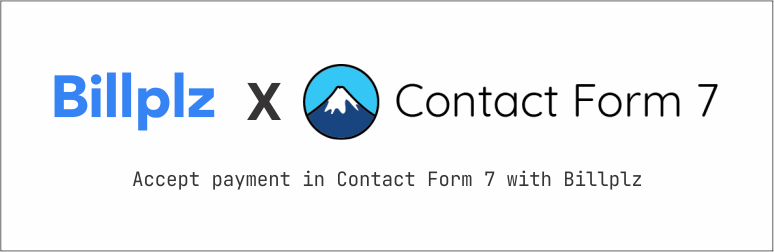

  

# Accept payment in Contact Form 7 by using Billplz.

### Description
This is a gateway extension for Contact Form 7 plugin to use Billplz Payment Gateway.

Payments are processed offsite at [Billplz](https://billplz.com) and the customer will be redirected back to your site after completing the payment.

### Changelog

#### 1.0.2, December 24, 2022
* New: Display current mode status (Live / Test) on the dashboard's admin bar.
* New: A payment redirect page will be automatically created and selected by default upon plugin activation.
* Improvement on settings page UI

#### 1.0.1, December 16, 2022
* Fix: Fatal error upon activation when Contact Form 7 is not active.

#### 1.0.0, December 14, 2022
* Stable release

#### 0.1.0, November 29, 2022
* Release Candidate-1
